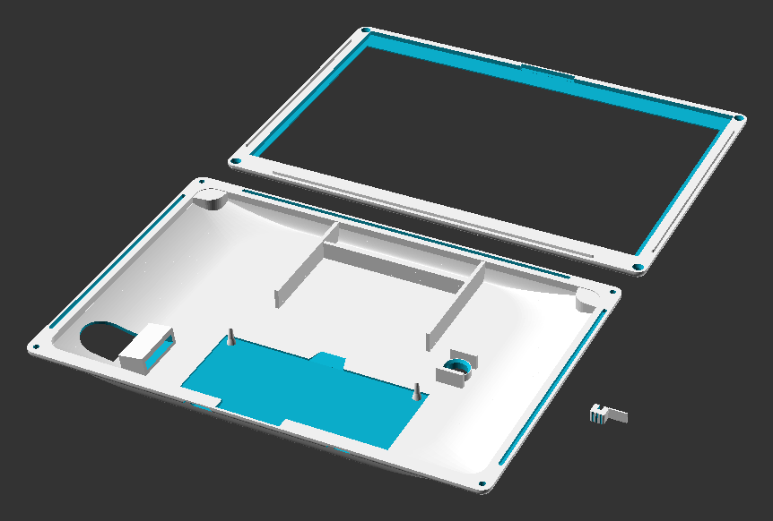
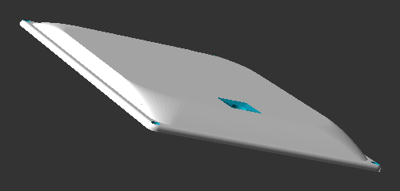

# KomaBon 3D Enclosure



Parametric split-shell sandwich enclosure designed in OpenSCAD for the **KomaBon** e-reader (TRMNL 7.5" E-Ink display + Seeed Studio XIAO ESP32-S3 carrier board).



*Rear tub interior: LiPo battery pocket, screen support ribs, angled microSD tunnel, and M2 corner counterbores.*

---

## 📐 Architecture & Key Features

* **Split-Shell Horizontal Sandwich:** Top frame and bottom tub mating via a perimeter Tongue & Groove joint (`joint_lip_h = 1.2 mm`, `joint_tol = 0.25 mm`) secured by 4x M2 corner fasteners.
* **Display Support & Anti-Fulcrum Relief:** Dedicated screen resting shoulder with a 0.3 mm clearance relief (`screen_support_H = 9.7 mm`) on the internal ribs, preventing bending stress across the fragile glass e-ink panel.
* **Tilted MicroSD Tunnel Slot:** An 8° angled internal tunnel elevates the card slot, enabling effortless insertion and spring-ejection through the side wall without tweezers.
* **5-Way Joystick Well:** Sized for standard Caddx / micro 5-way joystick modules with 90° lateral supporting ribs and a thumb-friendly outer square-to-round bezel.
* **Dedicated Power Switch Lever Clip:** Standalone 3D-printable slider with a rear retaining tongue that clips directly onto the onboard SMD slide switch, providing a tactile external control.
* **LiPo Battery Compartment:** Centered battery retention pocket ($60.5 \times 46.0\text{ mm}$) keeping the power cell safely away from heat and mechanical components.

---

## 🔩 Hardware BOM (Fasteners)

| Item | Specification | Qty | Notes |
| :--- | :--- | :---: | :--- |
| **Heat-Set Threaded Inserts** | M2 brass inserts (OD $\approx 3.2\text{ mm}$, length $3.0 - 3.2\text{ mm}$) | 4 | Melted into the front panel blind holes (`insert_d = 3.2 mm`) with a soldering iron |
| **Cap Screws** | M2 socket head cap screws (DIN 912), $8\text{ mm}$ or $10\text{ mm}$ length | 4 | Recessed into the rear tub counterbores (`screw_head_d = 4.3 mm`) |

---

## 🖨️ 3D Printing Guidelines (FDM)

The model is designed specifically for additive FDM manufacturing without requiring difficult supports.

### Recommended Slicer Settings

* **Layer Height:** `0.16 mm` (first layer `0.20 mm`) for smooth fillets and precise joint tolerances.
* **Perimeters / Wall Loops:** `4` or `5` walls.
  > 💡 **Important:** 4+ perimeters ensure the corner screw bosses (`boss_D = 7.0 mm`) and insert holes are printed as **100% solid plastic**, preventing delamination during heat-set insert installation.
* **Infill:** `25% - 30%` (Gyroid or Adaptive Cubic) for even thermal and mechanical stress distribution.
* **Material:**
  * **PETG (Recommended):** High layer adhesion, UV/heat resistance, and optimal elasticity for the tongue-and-groove snap fit.
  * **PLA+ / Tough PLA:** Easy to print, excellent dimensional stability.

### Bed Orientation

1. **Front Panel (Top Frame):** Place flat face down on the build plate (textured or satin PEI bed recommended for an attractive front bezel finish). Prints without any support.
2. **Back Panel (Bottom Tub):** Place flat bottom down on the build plate. All internal walls and battery pockets build upwards cleanly. Optional tree/organic supports can be enabled solely for the MicroSD exit tunnel.
3. **Switch Lever Clip:** Small part; print with a 3–5 mm brim for bed adhesion.

---

## 🛠️ Modifying & Exporting

Open [`KomaBon_Case.scad`](KomaBon_Case.scad) in [OpenSCAD](https://openscad.org/):

1. Press **F5** to preview the layout.
2. Press **F6** to render the full CSG mesh.
3. Export individual parts (`File` > `Export as STL...`) by commenting out the unused components in Section 8:

```openscad
// To export only the front panel:
front_panel();

// To export only the rear tub:
// back_panel();

// To export only the switch clip:
// switch_lever_clip();
```
